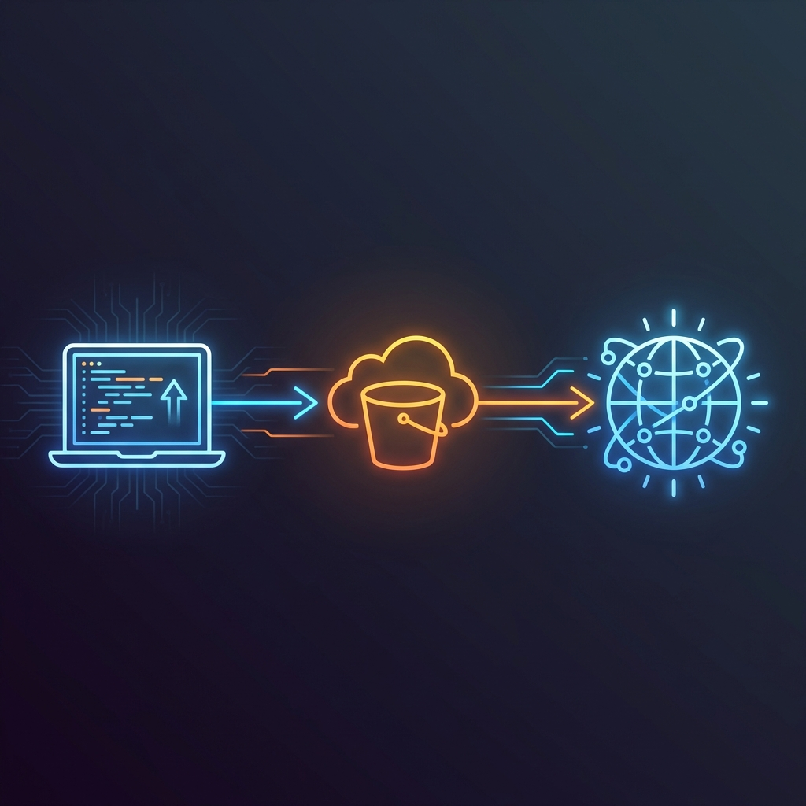

# Workstate
<p align="center">
  
</p>

<p align="center">
  <a href="README.pt-br.md">🇧🇷 Leia em Português</a>
</p>

**Portable Development Environment Management Tool**

Workstate is a powerful CLI tool that allows developers to preserve and restore the complete state of their development environments across different machines. Unlike version control systems that focus on source code, Workstate captures everything that makes your development environment unique - configurations, local databases, IDE settings, environment variables, and more.

## What Problem Does It Solve?

Have you ever needed to:
- Continue working on a project from a different machine with exactly the same setup?
- Preserve local development databases, configuration files, and IDE settings?
- Share a complete development environment with team members?
- Backup your development state including files that shouldn't go into version control?

Workstate solves these problems by creating compressed snapshots of your development environment and storing them safely in AWS S3.

## Key Features

- **Smart File Selection**: Uses `.workstateignore` files (similar to `.gitignore`) to define what should be included in the environment snapshot
- **Interactive Interface**: Friendly CLI with rich formatting and interactive menus
- **Selective Restore**: Download states without unpacking or restore full environments
- **AWS S3 Integration**: Secure cloud storage for your development states
- **Sharing**: Share/import states using temporary pre-signed AWS S3 URLs
- **Pre-built Templates**: Comes with optimized templates for popular development tools (Python, Node.js, Java, React, Angular, etc.)
- **Cross-platform**: Works on Windows, macOS, and Linux

## What Is Captured
You decide what gets captured, but the solution was designed to capture everything that traditional version control ignores.

Examples:
- **Environment Variables**: `.env`, `.env.local`, configuration files
- **IDE Settings**: `.vscode/`, `.idea/`, editor configurations
- **Local Scripts**: Test files, examples, seed scripts, context files (llms)
- **Local Databases**: SQLite files, local database dumps
- **Dev Containers**: docker-compose files, container volumes
- **Build Artifacts**: Compiled files, dependencies
- **Local Configs**: Tool-specific settings and preferences
- **Development Data**: Test data, mock files, local assets

<details>
  <summary><h2>Installation</h2></summary>

If you are using `workstate.exe`, ignore this topic.

### Prerequisites

- Python 3.8+
- AWS account with S3 access
- pip

### Dependencies

- **typer**: CLI Framework
- **rich**: Terminal formatting
- **boto3**: AWS SDK for Python

### Configuration Files

- **`.workstateignore`**: Defines files/directories to include/exclude
- **`~/.workstate/config.json`**: Stores AWS credentials

### Install from Source (Python only)

```bash
git clone https://github.com/yourusername/workstate.git
cd workstate
pip install -r requirements.txt
```

</details>


<details>
  <summary><h2>AWS Configuration and Permissions</h2></summary>

### 1. Create an AWS Account

If you don't have an AWS account, create one at [aws.amazon.com](https://aws.amazon.com).

### 2. Create an IAM User

1. Go to the AWS IAM Console
2. Create a new user for Workstate
3. Attach the **AmazonS3FullAccess** policy or create a custom policy with the following permissions:

```json
{
    "Version": "2012-10-17",
    "Statement": [
        {
            "Effect": "Allow",
            "Action": [
                "s3:GetObject",
                "s3:PutObject",
                "s3:DeleteObject",
                "s3:ListBucket"
            ],
            "Resource": [
                "arn:aws:s3:::your-workstate-bucket",
                "arn:aws:s3:::your-workstate-bucket/*"
            ]
        }
    ]
}
```

### 3. Get Access Keys

1. In the IAM console, select your user
2. Go to the "Security credentials" tab
3. Create access keys for CLI
4. **Important**: Save the Access Key ID and Secret Access Key securely

### 4. Create an S3 Bucket

1. Go to the AWS S3 Console
2. Create a new bucket with a unique name (e.g., `my-workstate-bucket-12345`)
3. Choose your preferred region
4. Keep default security settings
</details>

<details>
  <summary><h2>Quick Start</h2></summary>

### 1. Configure AWS Credentials

```bash
workstate configure
```

This will prompt for:
- **AWS Access Key ID**: Your IAM user's access key
- **AWS Secret Access Key**: Your IAM user's secret key
- **AWS Region**: The region where your S3 bucket is located (e.g., `us-east-1`, `sa-east-1`)
- **S3 Bucket Name**: The name of your S3 bucket

Alternative non-interactive configuration:
```bash
workstate configure --access-key-id AKIA... --secret-access-key xxx --region us-east-1 --bucket-name my-bucket --no-interactive
```

### 2. Initialize Your Project

```bash
# Initialize with a specific template
workstate init --tool python

# Or use the default template
workstate init
```

This creates a `.workstateignore` file optimized for your development stack.

### 3. Verify What Will Be Saved

```bash
workstate status
```

This shows all files and directories that will be included in the state snapshot.

### 4. Save Your Current State

```bash
workstate save "my-project-v1"
```
This zips all mapped files (the same ones listed in the status command) and uploads them to AWS S3.

### 5. List Available States

```bash
workstate list
```
Lists all zips in Workstate's AWS S3 bucket.

### 6. Restore a State
Downloads a state and unzips it locally. If there are file conflicts, reliable copies from the zip will be saved as duplicates following the pattern (duplicate_number), for example: file.txt, file (1).txt, file (2).txt.

```bash
workstate download
```
If you just want to download the state without restoring it immediately, use the `--download-only` option. The zip will be downloaded and stored in a `downloads` folder in the current directory.

```bash
workstate download --download-only
```
</details>


<details>
  <summary><h2>Command Reference</h2></summary>

### Available Commands

| Command | Description | Arguments | Options |
|---------|-------------|-----------|---------|
| `config` | Displays current Workstate configuration | - | - |
| `configure` | Configures AWS credentials | - | `--access-key-id, -a`, `--secret-access-key, -s`, `--region, -r`, `--bucket-name, -b`, `--interactive, -i` |
| `init` | Initializes a new Workstate project with `.workstateignore` file | - | `--tool, -t`: Tool type (default: `generic`) |
| `status` | Shows files tracked by Workstate | - | - |
| `save` | Saves the current project state to AWS S3 | `state_name`: Unique name for the state | - |
| `download` | Restores a saved state from AWS S3 | - | `--only-download`: Only downloads without extracting |
| `delete` | Deletes a saved state in AWS S3 | - | - |
| `list` | Lists all available states in AWS S3 | - | - |
| `download-pre-signed` | Restores a saved state from AWS S3 using a pre-signed URL | `base_url`, `signature`, `expires`: Pre-signed URL components | `--no-extract`, `--output, -o` |
| `share` | Generates a pre-signed AWS S3 URL to allow downloading a state without authentication | - | `--expiration, -e`: Hours until URL expires (default: 24) |

### Command Details

### `config`
**Functionality:** Displays current AWS configuration without revealing sensitive information.

**Displayed Information:**
- Access Key ID (masked)
- AWS Region
- Bucket Name
- Configuration Status


### `configure`
**Functionality:** Configures AWS credentials (stored in `~/.workstate/config.json`).

**Options:**
| Option | Abbreviation | Description |
|--------|--------------|-------------|
| `--access-key-id` | `-a` | AWS Access Key ID |
| `--secret-access-key` | `-s` | AWS Secret Access Key |
| `--region` | `-r` | AWS Region (e.g., us-east-1, sa-east-1) |
| `--bucket-name` | `-b` | S3 Bucket Name |
| `--interactive` | `-i` | Interactive mode (default: true) |

**Examples:**
```bash
# Interactive mode
workstate configure

# Non-interactive mode
workstate configure --access-key-id AKIA... --secret-access-key xxx --region us-east-1 --bucket-name my-bucket

# Mixed mode
workstate configure --region sa-east-1 --bucket-name my-workstate-bucket
```

### `init`
**Functionality:** Creates `.workstateignore` file with an optimized template for the specified tool.

**Valid Tools:** `python`, `node`, `java`, `go`, `generic`

**Examples:**
```bash
workstate init --tool python
workstate init -t node
workstate init  # uses generic template
```

### `status`
**Functionality:** Previews files that will be included in the next backup.

**Displayed Information:**
- File/Directory paths
- Individual sizes
- Total files and size


### `save`
**Functionality:** Compresses selected files and uploads to S3.

**Process:**
1. Parses `.workstateignore`
2. Creates temporary ZIP
3. Uploads to S3
4. Removes temporary file

**Examples:**
```bash
workstate save my-django-project
workstate save "project with spaces"
```

### `download`
**Functionality:** Interactive interface to restore saved states.

**Process:**
1. Lists available states
2. Interactive selection
3. ZIP download
4. Extraction (optional)
5. Cleanup of temporary files

**Options:**
| Option | Description |
|--------|-------------|
| `--only-download` | Downloads ZIP only without extracting |


### `delete`
**Functionality:** Deletes a saved state in AWS S3 interactively.

**Process:**
1. Lists available states
2. Interactive selection of state to delete
3. Deletion confirmation
4. Removal of file from S3


### `share`
**Functionality:** Generates a pre-signed URL to share a project state without AWS credentials.

**Process:**
1. Lists available states
2. Interactive state selection
3. Pre-signed URL generation
4. Display of URL and usage instructions

**Options:**
| Option | Abbreviation | Description |
|--------|--------------|-------------|
| `--expiration` | `-e` | Hours until URL expires (default: 24) |

**Examples:**
```bash
# URL valid for 24 hours (default)
workstate share

# URL valid for 48 hours
workstate share --expiration 48
workstate share -e 48
```


### `download-pre-signed`
**Functionality:** Downloads and restores a project state using a shared pre-signed URL.

**Arguments:**
| Argument | Description |
|----------|-------------|
| `base_url` | Base URL without signature or expiration |
| `signature` | Signature part of the pre-signed URL |
| `expires` | Expiration timestamp of the pre-signed URL |

**Options:**
| Option | Abbreviation | Description |
|--------|--------------|-------------|
| `--no-extract` | - | Do not extract ZIP file after download |
| `--output` | `-o` | Custom path for the downloaded file |

**Examples:**
```bash
# Automatic download and extraction
workstate download-pre-signed "https://bucket.s3.region.amazonaws.com/file.zip" "signature123" "1234567890"

# Download only without extraction
workstate download-pre-signed "https://bucket.s3.region.amazonaws.com/file.zip" "signature123" "1234567890" --no-extract

# Download to specific path
workstate download-pre-signed "https://bucket.s3.region.amazonaws.com/file.zip" "signature123" "1234567890" --output ./downloads/project.zip
```


### `list`
**Functionality:** Lists states saved in S3 with detailed information.

**Displayed Information:**
- Filename
- Size
- Modification date
- Sort by date (newest first)

</details>

<details>
  <summary><h2>.workstateignore File</h2></summary>

The `.workstateignore` file works similarly to `.gitignore`, but defines what is **ignored** in your state snapshot.
The idea is to ignore everything related to the repository. It supports:

- **Glob patterns**: `*.env`, `config/*`, `!.jar`
- **Directory inclusion**: `/.vscode/`
- **Specific files**: `database.sqlite3`
- **Comments**: Lines starting with `#`

### Example .workstateignore for Python:

```gitignore
# Ignores repository files and keeps local development files of a Python project
src/
.ruff_cache/
__pycache__
venv
.venv
requirements.txt
pyproject.*
.git
.gitignore
LICENSE
README.md
main.py
logs/
```

</details>

## Security Considerations

### Credential Storage
- Credentials are stored locally in `~/.workstate/config.json`
- Never commit this file to version control
- Use AWS IAM best practices for credential management
- Consider using AWS credential rotation policies

### Data Security
- All data is stored in your private S3 bucket
- Use S3 bucket policies to restrict access
- Consider enabling encryption at rest in S3
- Regularly review S3 access logs

### Best Practices
- Use separate AWS accounts for different projects
- Implement least privilege access policies
- Regularly audit saved states and remove unnecessary ones
- Be conscious about sensitive data in your development environment

## Important Notes

### What NOT To Include

Be careful not to include in your `.workstateignore` (meaning, do not capture):
- Large binary files that change frequently
- System temporary files
- OS-specific files (`.DS_Store`, `Thumbs.db`)
- Personal credentials that should remain machine-specific

### File Size Limits

- S3 has a single object limit of 5TB
- Consider cost implications of storing large development states
- Regularly clean up old states you no longer need

### Cross-Platform Compatibility

- File paths are handled using Python's `pathlib` for cross-platform compatibility
- Line ending differences are preserved as is
- Symlinks might not work across different operating systems


<details>
  <summary><h2>Troubleshooting</h2></summary>

### Common Issues

**"Access Denied" Errors:**
- Verify if your AWS credentials are correct
- Check if your IAM user has S3 permissions
- Ensure the S3 bucket exists and is accessible

**".workstateignore file not found":**
- Run `workstate init` to create one
- Ensure you are in the correct project directory

**Long upload times:**
- Check your `.workstateignore` for unnecessary large files
- Consider your internet connection speed
- Use `workstate status` to review what is being uploaded

**Configuration issues:**
- Use `workstate config` to verify your current settings
- Re-run `workstate configure` to update credentials

</details>


## Support the Project

If this project was useful to you or your team, consider leaving a **star** on the GitHub repository! This helps others discover Workstate and motivates me to continue improving the tool.
