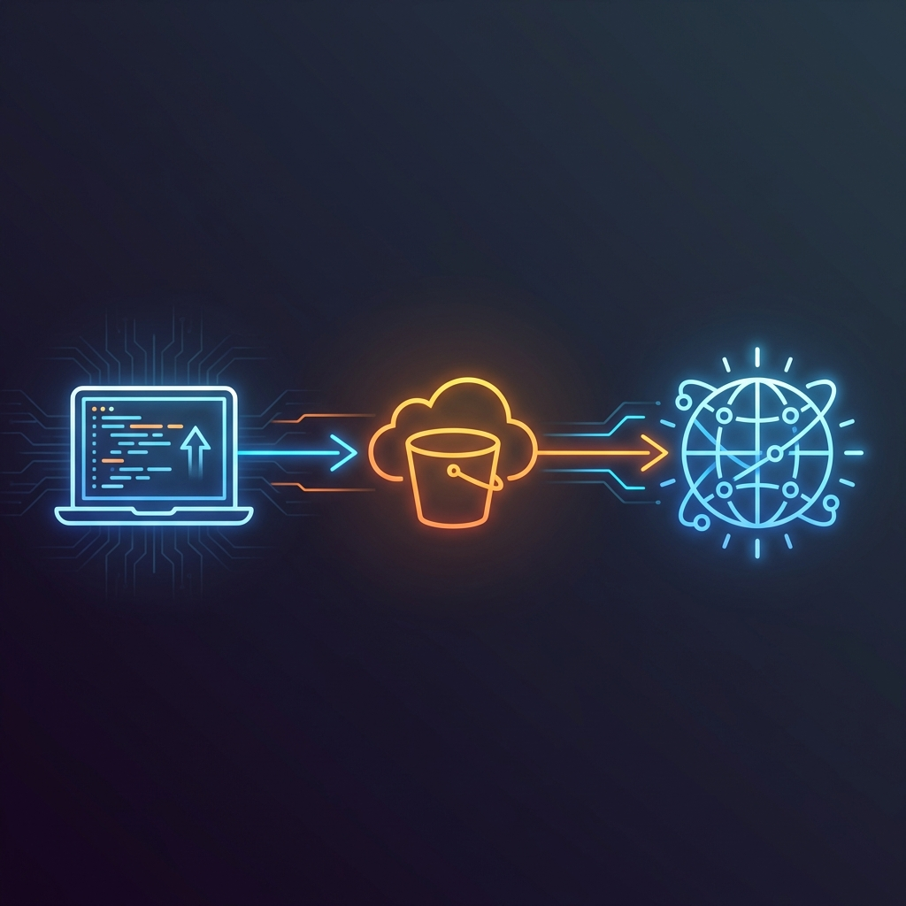

# Workstate
<p align="center">
  
</p>

**Ferramenta de Gerenciamento de Ambiente de Desenvolvimento Portátil**

Workstate é uma poderosa ferramenta CLI que permite aos desenvolvedores preservar e restaurar o estado completo de seus ambientes de desenvolvimento em diferentes máquinas. Diferentemente dos sistemas de controle de versão que focam no código-fonte, o Workstate captura tudo que torna seu ambiente de desenvolvimento único - configurações, bancos de dados locais, configurações de IDEs, variáveis de ambiente e muito mais.


## Qual Problema Resolve?

Você já precisou:
- Continuar trabalhando em um projeto de uma máquina diferente com exatamente a mesma configuração?
- Preservar bancos de dados de desenvolvimento locais, arquivos de configuração e configurações de IDE?
- Compartilhar um ambiente de desenvolvimento completo com membros da equipe?
- Fazer backup do seu estado de desenvolvimento incluindo arquivos que não devem ir para o controle de versão?

O Workstate resolve esses problemas criando snapshots comprimidos do seu ambiente de desenvolvimento e armazenando-os de forma segura no AWS S3.

## Principais Funcionalidades

- **Organização por Prefixos S3**: Organiza automaticamente os backups em pastas baseadas no nome do projeto, permitindo gerenciar múltiplos projetos no mesmo bucket de forma limpa.
- **Seleção Inteligente de Arquivos**: Usa arquivos `.workstateignore` (similar ao `.gitignore`) para definir o que deve ser incluído no snapshot do ambiente
- **Criptografia Client-side**: Proteja seus backups com criptografia AES baseada em senha (`--encrypt`)
- **Interface Interativa**: CLI amigável com formatação rica, menus interativos e **busca fuzzy**
- **Progresso em Tempo Real**: Feedback visual em tempo real durante o upload e download
- **Modo Dry-Run**: Simule o backup para verificar arquivos e tamanho total antes de subir para o S3
- **Restauração Seletiva**: Baixe estados sem descompactar ou restaure ambientes completos
- **Comparações Inteligentes**: Compare arquivos locais com estados no S3 antes de baixar (comando `compare`)
- **Inspeção Profunda**: Visualize o conteúdo de um ZIP e metadados diretamente no S3 sem baixar (comando `inspect`)
- **Rotação Automatizada**: Backups rotativos inteligentes com retenção configurável (comando `sync`)
- **Proteção de Estado**: Proteja estados importantes contra deleção acidental (comando `protect`)
- **Integração AWS S3**: Armazenamento seguro na nuvem para seus estados de desenvolvimento
- **Compartilhamento**: Compartilhe/importe estados utilizando URLs pré-assinadas temporárias e cópia automática para o clipboard
- **Integração com Git Hooks**: Ganchos de Git opcionais para te lembrar de salvar seu estado antes de um push ou restaurar após trocar de branch
- **Notificações de Atualização**: Verificações automáticas em segundo plano para garantir que você esteja sempre na versão mais recente
- **Templates Pré-construídos**: Vem com templates otimizados para ferramentas de desenvolvimento populares (Python, Node.js, Java, React, Angular, etc.)
- **Multiplataforma**: Funciona no Windows, macOS e Linux

## O Que É Capturado
Você é quem manda o que será capturado, mas a solução foi pensada para capturar tudo que o controle de versão tradicional ignora.

Exemplos:
- **Variáveis de Ambiente**: `.env`, `.env.local`, arquivos de configuração
- **Configurações de IDE**: `.vscode/`, `.idea/`, configurações de editores
- **Scripts locais**: Arquivos de teste, exemplos, scripts de seed, arquivos de contexto (llms) 
- **Bancos de Dados Locais**: Arquivos SQLite, dumps de bancos locais
- **Containers de Desenvolvimento**: Arquivos docker-compose, volumes de containers
- **Artefatos de Build**: Arquivos compilados, dependências
- **Configurações Locais**: Configurações específicas de ferramentas e preferências
- **Dados de Desenvolvimento**: Dados de teste, arquivos mock, assets locais

<details>
  <summary><h2>Instalação</h2></summary>

Se você for utilizar o `workstate.exe` ignore esse tópico.

### Pré-requisitos

- Python 3.8+
- Conta AWS com acesso ao S3
- pip

### Dependências

- **typer**: Framework para CLIs
- **rich**: Formatação de terminal
- **boto3**: SDK AWS para Python
- **pyperclip**: Suporte multiplataforma para área de transferência

### Arquivos de Configuração

- **`.workstateignore`**: Define arquivos/diretórios a serem incluídos/excluídos
- **`~/.workstate/config.json`**: Armazena credenciais AWS


### Instalar via pip (Recomendado)

```bash
pip install workstate
```

### Instalar do Código-fonte (somente via Python)

```bash
git clone https://github.com/seuusuario/workstate.git
cd workstate
pip install -r requirements.txt
```

</details>


<details>
  <summary><h2>Configuração AWS e Permissões</h2></summary>

### 1. Criar uma Conta AWS

Se você não tem uma conta AWS, crie uma em [aws.amazon.com](https://aws.amazon.com).

### 2. Criar um Usuário IAM

1. Vá para o Console AWS IAM
2. Crie um novo usuário para o Workstate
3. Anexe a política **AmazonS3FullAccess** ou crie uma política personalizada com as seguintes permissões:

```json
{
    "Version": "2012-10-17",
    "Statement": [
        {
            "Effect": "Allow",
            "Action": [
                "s3:GetObject",
                "s3:PutObject",
                "s3:DeleteObject",
                "s3:ListBucket"
            ],
            "Resource": [
                "arn:aws:s3:::seu-bucket-workstate",
                "arn:aws:s3:::seu-bucket-workstate/*"
            ]
        }
    ]
}
```

### 3. Obter Chaves de Acesso

1. No console IAM, selecione seu usuário
2. Vá para a aba "Credenciais de segurança"
3. Crie chaves de acesso para CLI
4. **Importante**: Salve o Access Key ID e Secret Access Key de forma segura

### 4. Criar um Bucket S3

1. Vá para o Console AWS S3
2. Crie um novo bucket com um nome único (ex: `meu-bucket-workstate-12345`)
3. Escolha sua região preferida
4. Mantenha as configurações padrão de segurança
</details>

<details>
  <summary><h2>Início Rápido</h2></summary>

### 1. Configurar Credenciais AWS

```bash
workstate configure
```

Isso solicitará:
- **AWS Access Key ID**: A chave de acesso do seu usuário IAM
- **AWS Secret Access Key**: A chave secreta do seu usuário IAM  
- **AWS Region**: A região onde seu bucket S3 está localizado (ex: `us-east-1`, `sa-east-1`)
- **S3 Bucket Name**: O nome do seu bucket S3

Configuração não-interativa alternativa:
```bash
workstate configure --access-key-id AKIA... --secret-access-key xxx --region us-east-1 --bucket-name meu-bucket --no-interactive
```

### 2. Inicializar Seu Projeto

```bash
# Inicializar com um template específico
workstate init --tool python

# Ou usar o template padrão
workstate init
```

Isso cria um arquivo `.workstateignore` otimizado para sua stack de desenvolvimento.

### 3. Verificar O Que Será Salvo

```bash
workstate status
```

Isso mostra todos os arquivos e diretórios que serão incluídos no snapshot do seu estado.

### 4. Salvar Seu Estado Atual

```bash
workstate save "meu-projeto-v1"
```
Isso compacta todos os arquivos mapeados em .zip e carrega para o AWS S3. Use `--dry-run` para simular o processo.


### 5. Listar Estados Disponíveis

```bash
workstate list
```
Lista todos os zips no AWS S3 do Workstate.

### 6. Restaurar um Estado
Baixa um estado e descompacta localmente. Caso haja repetição de arquivos, os arquivos repetidos do zip serão salvos 
como duplicatas seguindo o padrão (numero_da_duplicata), por exemplo: arquivo.txt, arquivo (1).txt, arquivo (2).txt.
```bash
workstate download
```
Caso queira apenas baixar o estado sem restaura-lo diretamente, use a opção `--download-only`, o zip será baixado e 
armazenado numa pasta `downloads` no diretório atual.
```bash
workstate download --download-only
```
</details>


<details>
  <summary><h2>Referência de Comandos</h2></summary>

### Comandos Disponíveis

| Comando | Descrição | Argumentos | Opções |
|---------|-----------|------------|--------|
| `config` | Exibe configuração atual do Workstate | - | - |
| `configure` | Configura credenciais AWS | - | `--access-key-id, -a`, `--secret-access-key, -s`, `--region, -r`, `--bucket-name, -b`, `--interactive, -i` |
| `init` | Inicializa um novo projeto Workstate com arquivo `.workstateignore` | - | `--tool, -t`: Tipo de ferramenta (padrão: `generic`) |
| `status` | Mostra arquivos rastreados pelo Workstate | - | - |
| `save` | Salva o estado atual do projeto no AWS S3 | `state_name`: Nome único para o estado | `--dry-run`, `--encrypt`, `--protect, -p`, `--description, -m`, `--tag` |
| `download` | Restaura um estado salvo do AWS S3 | - | `--only-download`, `--interactive, -i` |
| `delete` | Exclui um estado salvo no AWS S3 | - | `--interactive, -i`, `--force` |
| `list` | Lista todos os estados disponíveis no AWS S3 | - | `--interactive, -i`, `--system, -s`, `--branch, -b`, `--older-than, -o` |
| `inspect` | Visualiza conteúdo de um ZIP de estado no S3 | `state_name` (opcional) | - |
| `compare` | Compara arquivos locais com um estado remoto | `state_name` (opcional) | - |
| `sync` | Realiza backup rotativo automatizado | - | `--retention, -r` (padrão: 5) |
| `protect` | Marca um estado como protegido | - | - |
| `unprotect` | Remove a proteção de um estado | - | - |
| `profile` | Gerencia templates de ignore reutilizáveis | `action` (save/list/delete/push/pull) | `--remote, -r` (para delete) |
| `doctor` | Verifica saúde do sistema e conectividade AWS | - | - |
| `prune` | Remove estados antigos baseado em retenção | - | `--older-than`, `--all, -a`, `--force, -f` |
| `report` | Gera relatórios de armazenamento e custos | - | `--tags, -t` (padrão: Project) |
| `download-pre-signed` | Restaura um estado salvo do AWS S3 a partir de uma URL pré-assinada | `base_url`, `signature`, `expires` | `--no-extract`, `--output, -o` |
| `share` | Gera uma URL pré-assinada do AWS S3 e a copia para a área de transferência | - | `--expiration, -e`: Horas (padrão: 24) |
| `git-hook install` | Instala ganchos Git (post-checkout, pre-push) | - | `--push/--no-push`, `--checkout/--no-checkout` |
| `git-hook uninstall` | Remove os ganchos Git do Workstate do repositório atual | - | - |

### Detalhamento dos Comandos

### `config`
**Funcionalidade:** Exibe configuração AWS atual sem revelar informações sensíveis.

**Informações exibidas:**
- Access Key ID (mascarado)
- Região AWS
- Nome do bucket
- Status da configuração


### `configure`
**Funcionalidade:** Configura credenciais AWS (armazenadas em `~/.workstate/config.json`).

**Opções:**
| Opção | Abreviação | Descrição |
|-------|------------|-----------|
| `--access-key-id` | `-a` | AWS Access Key ID |
| `--secret-access-key` | `-s` | AWS Secret Access Key |
| `--region` | `-r` | Região AWS (ex: us-east-1, sa-east-1) |
| `--bucket-name` | `-b` | Nome do bucket S3 |
| `--interactive` | `-i` | Modo interativo (padrão: true) |

**Exemplos:**
```bash
# Modo interativo
workstate configure

# Modo não-interativo
workstate configure --access-key-id AKIA... --secret-access-key xxx --region us-east-1 --bucket-name my-bucket

# Modo misto
workstate configure --region sa-east-1 --bucket-name my-workstate-bucket
```

### `init`
**Funcionalidade:** Cria arquivo `.workstateignore` com template otimizado para a ferramenta especificada.

**Ferramentas válidas:** `python`, `node`, `java`, `go`, `generic`

**Exemplos:**
```bash
workstate init --tool python
workstate init -t node
workstate init  # usa template generic
```

### `status`
**Funcionalidade:** Visualiza arquivos que serão incluídos no próximo backup.

**Informações exibidas:**
- Caminhos de arquivos/diretórios
- Tamanhos individuais
- Total de arquivos e tamanho


### `save`
**Funcionalidade:** Comprime arquivos selecionados e faz upload para S3.

**Opções:**
| Opção | Abreviação | Descrição |
|-------|------------|-----------|
| `--dry-run` | - | Simula o processo sem fazer upload |
| `--encrypt` | - | Criptografa o backup com uma senha (AES) |
| `--protect` | `-p` | Protege o estado contra deleção acidental |
| `--description` | `-m` | Descrição ou motivo opcional do backup |
| `--tag` | - | Tags S3 customizadas no formato `chave=valor` |

**Processo:**
1. Analisa o `.workstateignore`
2. Varre em busca de arquivos sensíveis (ex: `.env`, `.pem`, `id_rsa`) e alerta o usuário
3. Cria um ZIP temporário (criptografado se solicitado)
4. Upload para o S3 dentro de uma pasta com o nome do projeto: `s3://seu-bucket/nome-do-projeto/nome-do-estado.zip`
5. Remove o arquivo temporário

**Exemplos:**
```bash
workstate save meu-projeto-django
workstate save meu-projeto-secreto --encrypt
workstate save production-hotfix -p -m "Correção crítica"
```

### `download`
**Funcionalidade:** Interface interativa para restaurar estados salvos.

**Processo:**
1. Lista estados disponíveis
2. Seleção interativa
3. Download do ZIP
4. Extração (opcional)
5. Limpeza de arquivos temporários

**Opções:**
| Opção | Descrição |
|-------|-----------|
| `--only-download` | Baixa apenas o ZIP sem extrair |


### `delete`
**Funcionalidade:** Exclui um estado salvo no AWS S3 de forma interativa.

**Processo:**
1. Lista estados disponíveis
2. Seleção interativa do estado a ser excluído
3. Confirmação da exclusão
4. Remoção do arquivo do S3


### `share`
**Funcionalidade:** Gera uma URL pré-assinada personalizada para compartilhar um estado do projeto e a copia automaticamente para a área de transferência do sistema.

**Processo:**
1. Lista estados disponíveis
2. Seleção interativa do estado
3. Geração da URL pré-assinada
4. Exibição da URL e instruções de uso

**Opções:**
| Opção | Abreviação | Descrição |
|-------|------------|-----------|
| `--expiration` | `-e` | Horas até a URL expirar (padrão: 24) |

**Exemplos:**
```bash
# URL válida por 24 horas (padrão)
workstate share

# URL válida por 48 horas
workstate share --expiration 48
workstate share -e 48
```


### `download-pre-signed`
**Funcionalidade:** Baixa e restaura um estado do projeto usando uma URL pré-assinada compartilhada.

**Argumentos:**
| Argumento | Descrição |
|-----------|-----------|
| `base_url` | URL base sem assinatura ou expiração |
| `signature` | Parte da assinatura da URL pré-assinada |
| `expires` | Timestamp de expiração da URL pré-assinada |

**Opções:**
| Opção | Abreviação | Descrição |
|-------|------------|-----------|
| `--no-extract` | - | Não extrai o arquivo ZIP após o download |
| `--output` | `-o` | Caminho personalizado para o arquivo baixado |

**Exemplos:**
```bash
# Download e extração automática
workstate download-pre-signed "https://bucket.s3.region.amazonaws.com/file.zip" "signature123" "1234567890"

# Apenas download sem extração
workstate download-pre-signed "https://bucket.s3.region.amazonaws.com/file.zip" "signature123" "1234567890" --no-extract

# Download para caminho específico
workstate download-pre-signed "https://bucket.s3.region.amazonaws.com/file.zip" "signature123" "1234567890" --output ./downloads/project.zip
```


### `list`
**Funcionalidade:** Lista estados salvos no S3 com informações detalhadas.

**Opções:**
| Opção | Abreviação | Descrição |
|-------|------------|-----------|
| `--system` | `-s` | Filtrar por SO (Windows, Linux, Darwin) |
| `--branch` | `-b` | Filtrar por branch do Git |
| `--older-than`| `-o` | Filtrar por duração (ex: 7d, 1m, 24h) |
| `--interactive`| `-i` | Abre o selecionador interativo com busca fuzzy |

**Informações exibidas:**
- Nome do arquivo (marcado com 🔒 se protegido ou 🔒 encoded se criptografado)
- Tamanho (formatado para leitura amigável)
- Data de modificação (formatada como YYYY-MM-DD HH:MM:SS)
- Metadados do projeto (Branch Git, commit)
- Ordenação por data (mais recente primeiro)

### `inspect`
**Funcionalidade:** Visualiza o conteúdo interno de um arquivo de estado no S3 sem precisar baixá-lo completamente.

**Processo:**
1. Baixa os cabeçalhos do ZIP do S3
2. Exibe uma tabela com todos os arquivos, seus tamanhos e datas de modificação
3. Se criptografado, solicita a senha para descriptografia

**Exemplos:**
```bash
workstate inspect meu-projeto.zip
workstate inspect  # abre selecionador interativo
```

### `compare`
**Funcionalidade:** Compara o estado do projeto local com um backup remoto.

**Processo:**
1. Busca metadados do estado remoto
2. Varre os arquivos locais (respeitando `.workstateignore`)
3. Mostra um diff: arquivos NOVOS, MODIFICADOS e AUSENTES localmente

### `sync`
**Funcionalidade:** Backup rotativo automatizado projetado para CI/CD ou tarefas agendadas (CRON).

**Processo:**
1. Compara o estado local com o último checkpoint remoto
2. Sobe um novo `checkpoint-TIMESTAMP.zip` apenas se mudanças forem detectadas
3. Remove automaticamente os checkpoints mais antigos baseado na retenção

**Opções:**
| Opção | Abreviação | Descrição |
|-------|------------|-----------|
| `--retention` | `-r` | Número máximo de checkpoints a manter (padrão: 5) |

### `protect` / `unprotect`
**Funcionalidade:** Gerencia o status de proteção de arquivos de estado para evitar deleção acidental. Arquivos protegidos não podem ser removidos pelos comandos `delete` ou `prune`, a menos que `--force` seja utilizado.

**Processo:**
1. Lista os estados disponíveis
2. Seleção interativa do estado a ser protegido/desprotegido
3. Atualiza os metadados no S3 com `protected=true` (ou `false`)
4. Exibe a confirmação do novo status

**Feedback Visual:**
Estados protegidos são marcados com um ícone de **🔒 (cadeado vermelho)** no comando `list`.

### `profile`
**Funcionalidade:** Gerencia configurações do `.workstateignore` como perfis reutilizáveis.

**Subcomandos:**
- `save <nome>`: Salva o `.workstateignore` atual como um perfil local
- `list`: Mostra todos os perfis locais e remotos
- `delete <nome>`: Remove um perfil (use `--remote` para S3)
- `push <nome>`: Upload de perfil local para o S3
- `pull <nome>`: Download de perfil do S3 para local

### `doctor`
**Funcionalidade:** Executa testes de diagnóstico para credenciais AWS, conectividade com o bucket S3 e validade da configuração local.

**Testes Realizados:**
1. **Configuração Local**: Verifica se o arquivo `~/.workstate/config.json` existe e contém credenciais AWS válidas.
2. **Conectividade AWS**: Testa a autenticação com o AWS STS (`get-caller-identity`) para garantir que suas chaves são válidas.
3. **Acesso ao Bucket S3**: Verifica se o bucket de destino existe e valida as permissões realizando uma operação temporária de Escrita/Deleção.

### `prune`
**Funcionalidade:** Limpeza em massa de arquivos de estado antigos de um ou todos os projetos.

**Processo:**
1. Varre em busca de estados mais antigos que a duração especificada (padrão: 30 dias)
2. Filtra e ignora os **estados protegidos**
3. Exibe uma lista de candidatos para exclusão
4. Solicita confirmação (a menos que `--force` seja usado)
5. Remove os objetos do S3

**Opções:**
| Opção | Abreviação | Descrição |
|-------|------------|-----------|
| `--older-than` | - | Duração (ex: 30d, 3m, 24h) |
| `--all` | `-a` | Limpa estados de todos os projetos no bucket |
| `--force` | `-f` | Pula confirmação e exclui estados protegidos |

### `report`
**Funcionalidade:** Gera relatórios detalhados sobre o consumo de armazenamento e custos estimados do S3.

**Opções:**
| Opção | Abreviação | Descrição |
|-------|------------|-----------|
| `--tags` | `-t` | Tags separadas por vírgula para agrupar (padrão: Project) |

</details>

<details>
  <summary><h2>Hooks e Automação</h2></summary>

### Hooks de Pós-Restauração
O Workstate suporta automação via um arquivo `.workstate-hooks` na raiz do projeto. Se o arquivo existir, seus comandos serão executados automaticamente após um `download` bem-sucedido.

**Exemplo de `.workstate-hooks`:**
```bash
# Comandos para rodar após restauração
npm install
docker-compose up -d
python manage.py migrate
```

### Integração com Git
Ao salvar um estado, o Workstate detecta e preserva automaticamente:
- **Branch Git**: Salvo nas tags (`Branch`) e metadados (`git-branch`) do S3
- **Commit Git**: Salvo nas tags (`Git-Commit`) e metadados (`git-commit`) do S3

Isso permite:
- **Filtragem**: Use `list --branch <name>` para encontrar estados específicos
- **Rastreabilidade**: Saiba exatamente qual versão do código gerou cada estado
- **Prevenção de Conflitos**: Verifique se um estado pertence à sua branch atual antes de baixar

### Integração com Git Hooks
Mantenha a consistência entre seu código e seu ambiente de desenvolvimento usando ganchos de Git:

```bash
# Instala ambos os ganchos (post-checkout e pre-push)
workstate git-hook install

# Instalação seletiva
workstate git-hook install --no-checkout
```

- **post-checkout**: Dispara após `git checkout` ou `git switch`, lembrando você de rodar `workstate download`.
- **pre-push**: Dispara antes do `git push`, lembrando você de rodar `workstate save` ou `workstate sync`.

Para remover os ganchos:
```bash
workstate git-hook uninstall
```

### Automação de Release
O Workstate segue um fluxo de CI/CD via GitHub Actions. Sempre que um novo Release é publicado no GitHub:
- O pacote Python é automaticamente construído e publicado no **PyPI** via Trusted Publishing (OIDC).
- Um Release correspondente no GitHub é criado com os binários pré-compilados para Windows.

<details>
  <summary><h2>Arquivo .workstateignore</h2></summary>

O arquivo `.workstateignore` funciona de forma similar ao `.gitignore`, mas define o que **ignorado** no snapshot do seu estado.
A ideia é ignorar tudo que for referente ao repositório. Ele suporta:

- **Padrões glob**: `*.env`, `config/*`, `!.jar`
- **Inclusão de diretórios**: `/.vscode/`
- **Arquivos específicos**: `database.sqlite3`
- **Comentários**: Linhas começando com `#`

### Exemplo .workstateignore para Python:

```gitignore
# Ignora arquivos do repositório e mantém arquivos de desenvolvimento local de um projeto Python
src/
.ruff_cache/
__pycache__
venv
.venv
requirements.txt
pyproject.*
.git
.gitignore
LICENSE
README.md
main.py
logs/
```

</details>

## Considerações de Segurança

### Armazenamento de Credenciais
- Credenciais são armazenadas localmente em `~/.workstate/config.json`
- Nunca commite este arquivo no controle de versão
- Use as melhores práticas do AWS IAM para gerenciamento de credenciais
- Considere usar políticas de rotação de credenciais da AWS

### Segurança de Dados
- Todos os dados são armazenados no seu bucket S3 privado
- **Detecção de Arquivos Sensíveis**: O Workstate varre automaticamente o projeto em busca de arquivos como `id_rsa`, `.pem`, `.env`, e `credentials.json` durante o processo de salvamento e alerta você antes do upload.
- Use políticas de bucket S3 para restringir acesso
- Considere habilitar criptografia em repouso no S3
- Revise regularmente os logs de acesso do S3

### Melhores Práticas
- Use contas AWS separadas para diferentes projetos
- Implemente políticas de acesso de menor privilégio
- Audite regularmente estados salvos e remova os desnecessários
- Seja consciente sobre dados sensíveis no seu ambiente de desenvolvimento


## Notas Importantes

### O Que NÃO Incluir

Tenha cuidado para não incluir no seu `.workstateignore`:
- Arquivos binários grandes que mudam com frequência
- Arquivos temporários do sistema
- Arquivos específicos do SO (`.DS_Store`, `Thumbs.db`)
- Credenciais pessoais que devem permanecer específicas da máquina

### Limites de Tamanho de Arquivo

- O S3 tem um limite de objeto único de 5TB
- Considere as implicações de custo de armazenar estados de desenvolvimento grandes
- Limpe regularmente estados antigos que você não precisa mais

### Compatibilidade Multiplataforma

- Caminhos de arquivos são tratados usando `pathlib` do Python para compatibilidade multiplataforma
- Diferenças de terminação de linha são preservadas como estão
- Links simbólicos podem não funcionar entre diferentes sistemas operacionais

### Atalho de Ajuda
- Você pode usar `-h` como um atalho para `--help` em qualquer comando.


<details>
  <summary><h2>Solução de Problemas</h2></summary>

### Problemas Comuns

**Erros de "Access Denied":**
- Verifique se suas credenciais AWS estão corretas
- Verifique se seu usuário IAM tem permissões S3
- Certifique-se de que o bucket S3 existe e está acessível

**"Arquivo .workstateignore não encontrado":**
- Execute `workstate init` para criar um
- Certifique-se de estar no diretório correto do projeto

**Tempos de upload longos:**
- Verifique seu arquivo `.workstateignore` para arquivos grandes desnecessários
- Considere a velocidade da sua conexão com a internet
- Use `workstate status` para revisar o que está sendo carregado

**Problemas de configuração:**
- Use `workstate config` para verificar suas configurações atuais
- Re-execute `workstate configure` para atualizar credenciais

</details>


<details>
  <summary><h2>Desenvolvimento a partir do Código-fonte</h2></summary>

### 1. Build e Instalação Local
Se você deseja buildar e instalar o Workstate para fins de desenvolvimento:

1. **Configurar Ambiente de Desenvolvimento**:
   ```bash
   git clone https://github.com/mtpontes/workstate.git
   cd workstate
   pip install -r requirements.txt
   ```

2. **Gerar Build e Instalar**:
   Utilize os scripts de conveniência definidos no `pyproject.toml` (requer [Hatch](https://hatch.pypa.io/)):
   ```bash
   # Limpar builds anteriores
   hatch run clean
   
   # Buildar e reinstalar localmente com força
   hatch run build-local
   ```

### 2. Desenvolvimento da Documentação
A documentação é construída com [Starlight (Astro)](https://starlight.astro.build/).

1. **Pré-requisitos**:
   - Node.js v22 (gerenciado via [nvm](https://github.com/coreybutler/nvm-windows))

2. **Rodar Servidor Local**:
   ```bash
   # Usando o atalho
   hatch run docs-serve
   
   # Ou manualmente
   cd docs-site
   nvm use 22
   npm install
   npm run dev
   ```

3. **Gerar Build da Documentação**:
   ```bash
   cd docs-site
   npm run build
   ```
</details>

## Apoie o Projeto

Se este projeto foi útil para você ou para sua equipe, considere deixar uma **estrela** no repositório do GitHub! Isso ajuda outras pessoas a descobrirem o Workstate e me motiva a continuar melhorando a ferramenta.
